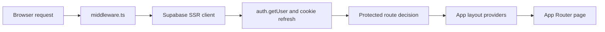
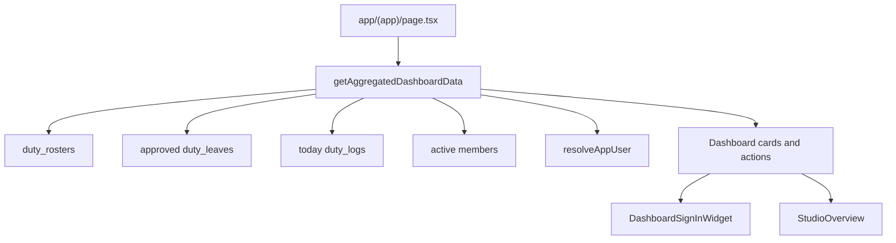
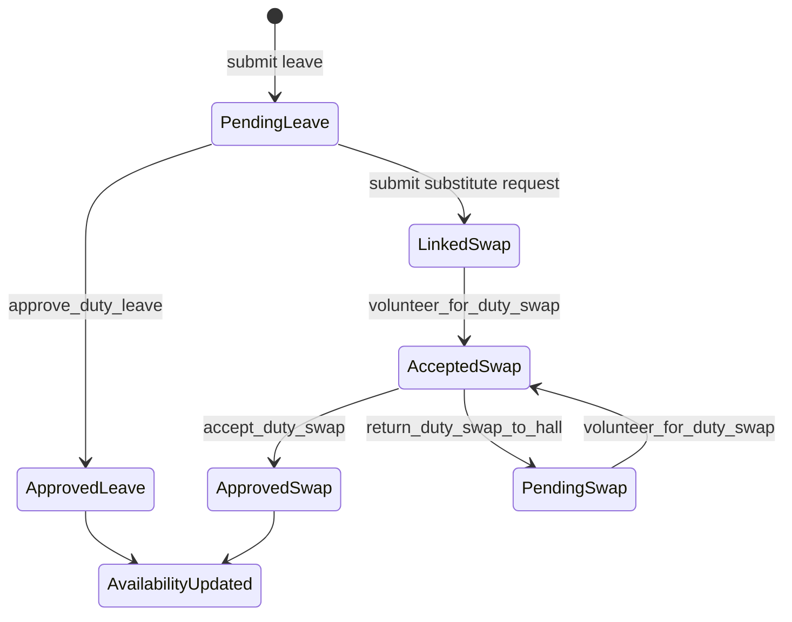

# Architecture Notes

Club Platform is a Next.js App Router application backed by Supabase Auth, Postgres, Storage, and RLS policies. The current architecture keeps server aggregation, browser-only interactions, and database state transitions separated so the duty workflow remains explainable and testable.

## Request And Auth Flow

- `middleware.ts` delegates session refresh and protected-route decisions to `utils/supabase/middleware.ts`.
- `app/layout.tsx` keeps the root shell server-rendered and mounts client providers for theme, toast, store hydration, and auth sync.
- `AuthProvider` and `useUserStore` keep browser session state aligned after the server-side request boundary.

## Dashboard Data Flow

- `lib/services/dashboard-service.ts` performs the server-side dashboard aggregation.
- `DashboardSignInWidget` stays client-side because it depends on current time, geolocation, browser user agent, and protected writes.
- `StudioOverview` reads studio presence through a hook while cleanup is handled by the `expire_studio_sessions` RPC.

## Duty Workflow

- `hooks/useDuty.ts` composes duty sub-hooks for rosters, sign-in, swaps, leaves, and key transfers.
- SQL files are the source of truth for state changes, especially `database/key_and_leave_schema.sql`, `database/update_swap_status.sql`, and `database/fix_duty_hall_permissions.sql`.
- The UI should reflect the database state machine rather than inventing a separate client-side lifecycle.

## Verification Surface

- Unit assertions cover date, duty-time, leave, and studio-time behavior.
- Playwright tests cover auth, duty flows, dashboard sign-in, member search, self-study, notifications, settings, and event RSVP.
- CI runs lint, typecheck, build, smoke E2E, and full E2E.
