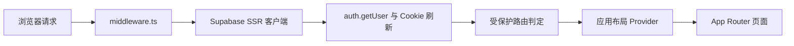
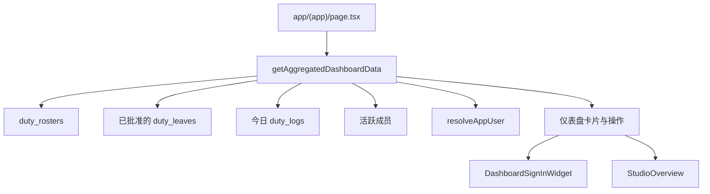
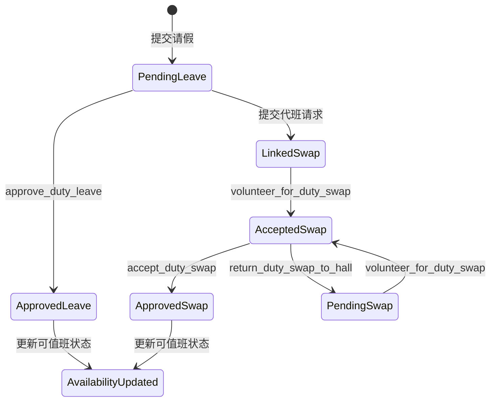

# 架构说明

本文聚焦“这套前端为什么这么分层”，重点解释请求链路、服务端聚合、客户端交互边界和数据库契约之间的关系。

如果你第一次阅读这个仓库，建议先看：

- [项目总览](./project-overview.md)
- [值班流程契约](./duty-contract.md)
- [面试讲稿](./interview-briefing.md)

本项目是一个基于 Next.js App Router 的应用，后端依托 Supabase Auth、Postgres、Storage 与 RLS 策略。当前架构把服务端聚合、浏览器端交互和数据库状态流转分层处理，因此值班流程既容易解释，也便于测试。

## 请求与鉴权链路

- `middleware.ts` 把会话刷新和受保护路由判断委托给 `utils/supabase/middleware.ts`。
- `app/layout.tsx` 保持根布局以服务端方式渲染，并挂载主题、toast、状态仓库回填和鉴权同步等客户端 provider 组件。
- `AuthProvider` 与 `useUserStore` 负责在服务端请求边界之后，持续对齐浏览器端会话状态。

## 仪表盘数据流

- `lib/services/dashboard-service.ts` 负责服务端仪表盘数据聚合。
- `DashboardSignInWidget` 保持为客户端组件，因为它依赖当前时间、地理定位、浏览器 user agent 和受保护写操作。
- `StudioOverview` 通过钩子读取工作室在场数据，而过期清理由 `expire_studio_sessions` 这个 RPC 处理。

## 值班流程

- `hooks/useDuty.ts` 负责组合排班、签到、代班、请假和钥匙交接等值班子域钩子。
- SQL 文件是状态流转的最终事实来源，尤其是 `database/key_and_leave_schema.sql`、`database/update_swap_status.sql` 和 `database/fix_duty_hall_permissions.sql`。
- 界面层应反映数据库状态机，而不是自行发明一套脱离后端的客户端生命周期。

## 验证覆盖面

- 单元断言覆盖日期、值班时间、请假和自习时长等行为。
- Playwright 测试覆盖鉴权、值班流程、仪表盘签到、成员搜索、自习、通知、设置和活动报名。
- 持续集成会运行 lint、typecheck、build、smoke E2E 和完整 E2E。

## 相关文档

- [项目总览](./project-overview.md)
- [值班流程契约](./duty-contract.md)
- [面试讲稿](./interview-briefing.md)
